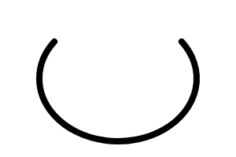

# Arc

Arc shape.




## Installation

    npm install @pencil.js/arc


## Examples

```js
import Arc from "@pencil.js/arc";

const horizontalRadius = 50;
const verticalRadius = 20;
const startAngle = -0.25;
const endAngle = 0.25;
const options = {
    stroke: "red",
};
const arc = new Arc(aPosition, horizontalRadius, verticalRadius, startAngle, endAngle, options);
```
