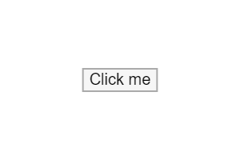

# Checkbox

Button user input.




## Installation

    npm install @pencil.js/button


## Examples

```js
import Button from "@pencil.js/button";

const options = {
    value: "Click me",
};
const button = new Button(aPosition, options);
```
