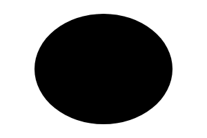

# EventEmitter

Ellipse shape (oval).




## Installation

    npm install @pencil.js/ellipse


## Examples

```js
import Ellipse from "@pencil.js/ellipse";

const position = [100, 200];
const width = 50;
const height = 20;
const options = {
    fill: "red",
};
const ellipse = new Ellipse(position, width, height, options);
```

## EllipseOptions
Inherit from [ComponentOptions](../component/readme.md#componentoptions).

Ellipse have no specific options.

