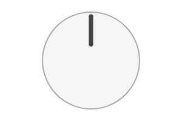

# Knob

Rotating knob component.




## Installation

    npm install @pencil.js/knob


## Examples

```js
import Knob from "@pencil.js/knob";

const options = {
    radius: 200, // radius in pixel
    min: 0, // Minimum value of the knob
    max: 10, // Maximum value of the knob
    value: 0, // initial value (from 0 to 1)
};
const knob = new Knob(aPosition, options);
knob.value = 0.5; // set to 50%
```
