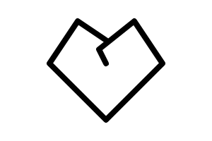

# Line

Line stroke passing through points.




## Installation

    npm install @pencil.js/line


## Examples

```js
import Line from "@pencil.js/line";

const options = {
    stroke: "red",
    strokeWidth: 9,
};
const line = new Line(from, [firstPoint, secondPoint, lastPoint], options);
```
