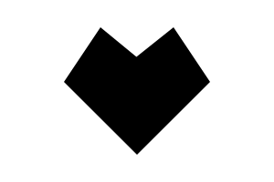

# Polygon

Shape from a bunch of points.




## Installation

    npm install @pencil.js/polygon


## Examples

```js
import Polygon from "@pencil.js/polygon";

const points = [aPosition, anotherPosition, yetAgainAPosition, lastPosition];
const options = {
    fill: "red",
    stroke: "#000"
};
const polygon = new Polygon(points, options);
```
