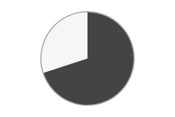

# Progress-pie

Progress-pie component.




## Installation

    npm install @pencil.js/progress-pie


## Examples

```js
import ProgressPie from "@pencil.js/progress-pie";

const options = {
    radius: 200, // radius in pixel
    value: 0, // initial value (from 0 to 1)
    speed: 0.3, // transition speed (0 means no changes, 1 mean instant change)
};
const progressPie = new ProgressPie(aPosition, options);
progressPie.value = 0.5; // set to 50%
```
