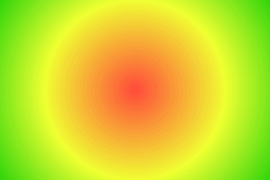

# Radial-gradient

Circular gradient transition of color(s) between a center and the radius of a circle.




## Installation

    npm install @pencil.js/radial-gradient


## Examples

```js
import RadialGradient from "@pencil.js/radial-gradient";
import Square from "@pencil.js/square";

const size = 200;
const square = new Square(aPosition, size, {
    fill: new RadialGradient([size / 2, size / 2], size / 2, {
        0: "red",
        0.5: "green",
        1: "blue",
    }),
});
```
