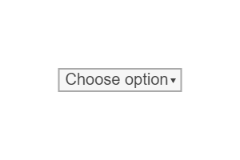

# Select

Select user input.




## Installation

    npm install @pencil.js/select


## Examples

```js
import Select from "@pencil.js/select";

const items = [
    null, // Selectable empty item
    "Unicorn",
    "Pony",
    "Doggy",
];
const options = {
    value: 1, // index of the default value
};
const select = new Select(aPosition, items, options);
```
