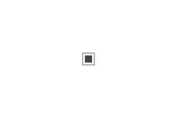

# Checkbox

Checkbox user input.




## Examples

```js
import { Checkbox } from "pencil.js";

const position = [100, 200];
const options = {
    value: true,
};
const checkbox = new Checkbox(position, options);
```

## CheckboxOptions
Inherit from [InputOptions](../input/readme.md#inputoptions).

| Name | Type | Default | Comment |
| ---- | ---- | ------- | ------- |
|size |`Number` |`20` |Width and height of the checkbox |
|value |`Boolean` |`false` |Whether it's check ot not |
