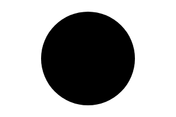

# Circle

Circle shape.




## Examples

```js
import { Circle } from "pencil.js";

const position = [100, 200];
const radius = 50;
const options = {
    fill: "red",
    stroke: "#000"
};
const circle = new Circle(position, radius, options);
```

## CircleOptions
Inherit from [EllipseOptions](../ellipse/readme.md#ellipseoptions).

Circle have no specific options.
