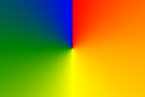

# Conic-gradient

Gradient transition of color(s) around a point.




## Examples

```js
import { ConicGradient, Square } from "pencil.js";

const position = [100, 200];
const size = 200;
const centerPosition = [size / 2, size / 2];
const startAngle = 0;
const square = new Square(position, size, {
    fill: new ConicGradient(centerPosition, startAngle, {
        0: "red",
        0.25: "orange",
        0.5: "yellow",
        0.75: "green",
        1: "blue",
    }),
});
```
