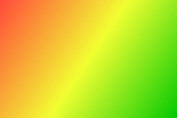

# Linear-gradient

Gradient transition of color(s) between two position.




## Examples

```js
import { LinearGradient, Square } from "pencil.js";

const position = [100, 200];
const size = 200;
const startPosition = [0, 0];
const endPosition = [size, size];
const square = new Square(position, size, {
    fill: new LinearGradient(startPosition, endPosition, {
        0: "red",
        0.5: "yellow",
        1: "green",
    }),
});
```
