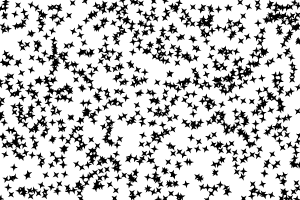

# Particles

Particle generator optimized to display thousands of instances.




## Examples

```js
import { Particles, Star, Math as M } from "pencil.js";

const position = [100, 200];
const base = new Star();
const count = 5000;
const generator = () => {
    return {
        position: scene.getRandomPosition(),
        rotation: M.random(),
        // And whatever value you want to define for each individual particle
    };
};
const updater = (data) => {
    data.position.add(data.speed);
};

const particles = new Particles(position, base, count, generator, updater);
```


## ParticlesOptions
Inherit from [ComponentOptions](../component/readme.md#componentoptions).

Particles have no specific options.
