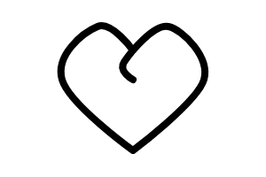

# Line

Hand-free drawing tool.




## Examples

```js
import { Path } from "pencil.js";

const from = startingPosition;
const path = new Path(from, [
    Path.lineTo(pos1),
    Path.moveTo(pos2),
    Path.quadTo(pos3, controlPoint),
    Path.bezierTo(pos4, controlPoint1, controlPoint2),
], isClosed, options);
```


## PathOptions
Inherit from [ComponentOptions](../component/readme.md#componentoptions) if the path is closed, or from [LineOptions](../line/readme.md#lineoptions) otherwise.

Path have no specific options.
