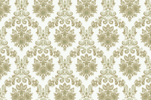

# Pattern

Repeated background filling from an image.




## Examples

```js
import { Pattern, Image, Circle } from "pencil.js";

const position = [100, 100];
const radius = 50;
const patternOptions = {
    repeat: Pattern.repetition.repeat,
    origin: "center",
    scale: 0.5,
};
// Preload the image
Image.load("pattern.png").then((image) => {
    const circle = new Circle(position, radius, {
        fill: new Pattern(image, patternOptions),
    });
});
```


## PatternOptions

| Name   | Type                                  | Default          | Comment                                                              |
|--------|---------------------------------------|------------------|----------------------------------------------------------------------|
| repeat | `String`                              | `"repeat"`       | Repetition rule                                                      |
| origin | [`Position`](../position)             | `new Position()` | Relative offset                                                      |
| scale  | `Number` or [`Position`](../position) | `1`              | Scaling ratio or a pair of value for horizontal and vertical scaling |
