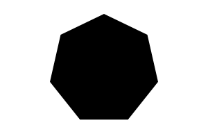

# RegularPolygon

Equiangular and equilateral convex polygon.




## Examples

```js
import { RegularPolygon } from "pencil.js";

const nbSides = 7;
const radius = 100;
const options = {
    fill: "gold",
    stroke: "#000"
};
const heptagon = new RegularPolygon(center, nbSides, radius, options);
```


## RegularPolygonOptions
Inherit from [PolygonOptions](../polygon/readme.md#polygonoptions).

Polygon have no specific options.
