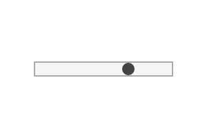

# Slider

Slider user input.




## Examples

```js
import { Slider } from "pencil.js";

const position = [100, 200];
const options = {
    min: 0,
    max: 100,
    value: 42
};
const slider = new Slider(position, options);
```


## SliderOptions
Inherit from [InputOptions](../input/readme.md#inputoptions).

| Name | Type | Default | Comment |
| ---- | ---- | ------- | ------- |
|min |`Number` |`0` |Minimum value when the slider is at lowest |
|max |`Number` |`10` |Maximum value when the slider is at highest |
|value |`Number` |`0` |Initial value |
|width |`Number` |`200` |Size of the slider |
