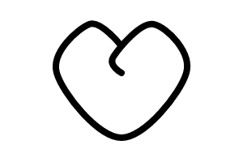

# Spline

Continuous curve passing through points.
The `tension` parameter define the strength of each points over the curve.
`0` mean it act like a line, `0.2` is the default value and render a smooth curve, value can be be as high as you want or even negative.




## Examples

```js
import { Spline } from "pencil.js";

const tension = 0.5;
const options = {
    stroke: "red",
};
const spline = new Spline(from, [firstPoint, secondPoint, lastPoint], tension, options);
```


## SplineOptions
Inherit from [LineOptions](../line/readme.md#lineoptions).

Spline has no specific options.
