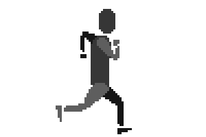

# Sprite

Sprite component.




## Examples

The easiest way to use sprites is using a spritesheet (a.k.a. Texture Atlas). A Spritesheet is a combination of a large image composed of smaller images
and a json file.
We even create our [own tool to build a spritesheet](https://github.com/pencil-js/spritesheet) from separate images.

Pencil.js offer an easy way to load and use a spritesheet.
```js
import { Sprite } from "pencil.js";

Sprite.sheet("spritesheet.json")
    .then((sheet) => {
        const position = scene.center;
        const selector = "image_*.png";
        const options = {
            speed: 1, // Change frame every draw call (~60 fps)
            loop: true, // Repeat the animation indefinitely
        };

        const sprite = sheet.extract(position, selector, options);
        // Equivalent to
        const sprite = new Sprite(position, sheet.file, sheet.get(selector), options);

        scene.add(sprite).startLoop();
    });
```

You can also use the `Sprite` class directly if you prefer, but you'll need to fill the frames list yourself.
```js
import Sprite from "@pencil.js/sprite";

const position = scene.center;
const url = "sprite-sheet.png";
const frames = [
   // list of frames data
];
const options = {
    speed: 1,
    loop: true,
};
const sprite = new Sprite(position, url, frames, options);
scene.add(sprite).startLoop();
```

## SpriteOptions
Inherit from [ImageOptions](../image/readme.md#imageoptions).

| Name  | Type      | Default | Comment                                                                           |
|-------|-----------|---------|-----------------------------------------------------------------------------------|
| speed | `Number`  | `1`     | Frame rate of the animation (1 means about 60 frame per seconds, 0 means stopped) |
| loop  | `Boolean` | `true`  | Should the animation start over indefinitely                                      |
