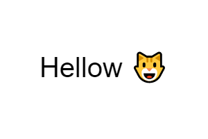

# Text

Text writing.




## Examples

```js
// This will override the native Text class !
import { Text } from "pencil.js";

const position = [100, 200];
const options = {
    font: "comic-sans",
    fontSize: 42
};
const message = new Text(position, "Hellow 😺", options);

// Change the text
message.text = "Henlo 🐶";

// Can be use to preload a bunch of fonts
Text.load([url1, url2, url3]).then(() => {
    console.log("Fonts ready");
});
```

Be aware this example overrides Javascript's `Text` global. Prefer another name for the import if you have collision.

```js
import { Text as PText } from "pencil.js";
```

## TextOptions
Inherit from [ComponentOptions](../component/readme.md#componentoptions).

| Name | Type | Default | Comment |
| ---- | ---- | ------- | ------- |
|font |`String` |`"sans-serif"` |Font to use (can be a URL) |
|fontSize |`Number` |`20` |Size of the text in pixels |
|align |`String` |`Text.alignments.start` |Text horizontal alignment (use the `origin` option to move the text) |
|bold |`Boolean` |`false` |Use bold font-weight |
|italic |`Boolean` |`false` |Use italic font-style |
|underscore |`Boolean` |`false` |Draw a line under the text |
|lineHeight |`Number` |`1` |Ratio of line height (1 is normal, 2 is twice the space) |
