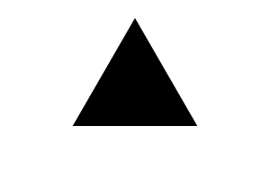

# Triangle

Regular triangle shape, if you want to draw a random shape with 3 points, use [Polygon](../polygon) instead.




## Examples

```js
import { Triangle } from "pencil.js";

const position = [100, 200];
const radius = 99;
const options = {
    fill: "blue"
};
const triangle = new Triangle(position, radius, options);
```


## RectangleOptions
Inherit from [RegularPolygonOptions](../regular-polygon/readme.md#regularpolygonoptions).

Triangle have no specific options.
